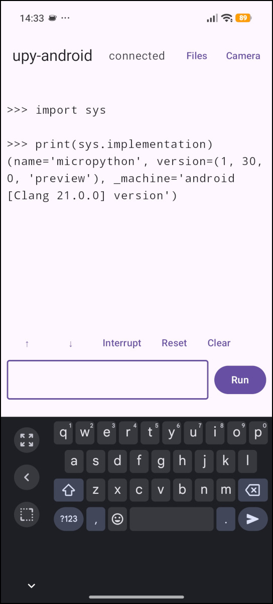

# upy-android

MicroPython on Android. Single APK, two processes.

## What it is

[](doc/screenshot_big.jpg)

MicroPython (`ports/embed`, not `ports/unix`) embedded via JNI in an Android app.
A bind-only `:engine` Service runs the interpreter; the main process runs the Compose UI.
Communicates over AIDL, not a REPL byte protocol.

Not a Termux wrapper.

No USB/hardware board required.

## Features

- MicroPython REPL with output streaming and interrupt
- File explorer, text editor, REPL.
- Camera and display modules (`csi`, `display`) backed by Camera2/NDK and `ANativeWindow`; camera screen in-app
- accelerometer/gyro module (`imu`) via NDK sensor API
- VFS rooted at app-private storage
- Bundled modules: `ulab`, `image` (OpenMV imlib subset)
- 32 MB micropython heap, settable.

## Design

- Single APK
- Two OS processes: UI (`main`), interpreter (`:engine`)
- micropython `ports/embed` + JNI, one reused worker thread in `:engine`
- AIDL: `exec`/`interrupt`/`reset`/`setOutputListener`/`setDisplaySurface`
- Idle/lazy Service bind; explicit `reset()` does in-process `mp_deinit()`+`mp_embed_init()`, not unbind/rebind
- Crash isolation verified: `kill -9` on `:engine` leaves UI intact
- arm64-v8a only. minSdk 26, compile/targetSdk 37

## Build Notes

Requirements: JDK 21, Android SDK 37, NDK 30, Gradle wrapper 9.7.1.

### GitHub Actions

fork, run the upy-android workflow, download the APK artifact.

### Docker target build

```bash
docker build --no-cache --target build --build-arg BUILD_TYPE=debug -t upy-android -f tools/docker/Dockerfile .
id=$(docker create upy-android)
docker cp "$id":/output/upy-debug.apk ~/Downloads/
docker rm "$id"
```

### Local build

```bash
export JAVA_HOME=/path/to/jdk-21
./gradlew assembleDebug
# -> app/build/outputs/apk/debug/app-debug.apk
```

### Install / run

```bash
adb install app/build/outputs/apk/debug/app-debug.apk
adb shell am start -n eu.kdvelectronics.upyandroid/.MainActivity
```

CAMERA permission is requested on first launch. Camera permission errors surface as OSError(errno.EACCES, ...) if denied.

## OpenMV

Compiles. Measured ~25 FPS on a Xiaomi Redmi Note 15 device running [`lcd_shield.py`](https://github.com/openmv/openmv/blob/master/scripts/examples/50-OpenMV-Boards/60-Shields/60-LCD-Shield/lcd_shield.py)

## Repo Layout

- `upstream/` upstream git clones: micropython, openmv
- `native-bringup/` overrides for openmv, micropython
- `app/src/main/cpp/micropython_embed/` generated from `my-overrides/` by `apply-overrides.sh`
- `app/src/main/cpp/*.{cpp,h}` own NDK modules

### Status

Working prototype. Largely generated with AI assistance, not fully audited. Use with caution.

### License

[MIT](LICENSE.md). Third-party attribution in [NOTICE](upy-android/NOTICE.md).

MicroPython, ulab, and OpenMV-derived files retain their upstream licenses.
