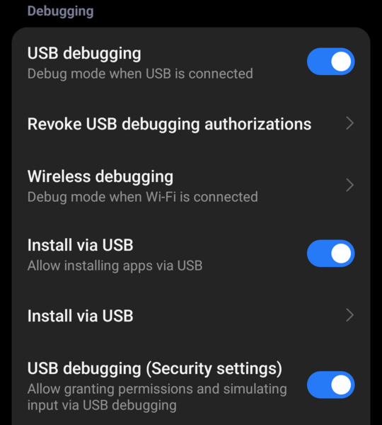

# Developer Notes

- Uses MicroPython `ports/embed`, not `ports/unix`.
- Two processes: the user interface and the MicroPython interpreter.
- The MicroPython file system is in the app's private storage.
- `arm64-v8a` only.

## Build

### Local build

Requirements:

- A full JDK 21, with `javac`.
- The Android SDK with the NDK, CMake and platform versions that the build uses. See [`tools/docker/Dockerfile`](../tools/docker/Dockerfile).
- `upy-android/local.properties` with the SDK path, for example `sdk.dir=/home/user/Android/Sdk`.

```bash
export JAVA_HOME=/path/to/jdk-21
cd upy-android
./gradlew :app:assembleDebug
# -> app/build/outputs/apk/debug/app-debug.apk
```

The first build downloads a lot:

- MicroPython, OpenMV, ulab and AprilTag from GitHub (`native-bringup/fetch-upstream.sh`).
- Libraries from Maven Central and Google Maven.

On a slow or filtered network, set a proxy or a mirror for Git and Gradle.

### Docker build

Run from the repo root:

```bash
docker build --target tools -t upy-android-tools -f tools/docker/Dockerfile .   # SDK/NDK install
docker build --target build --build-arg BUILD_TYPE=debug -t upy-android -f tools/docker/Dockerfile .
id=$(docker create upy-android)
docker cp "$id":/output ~/upy-android_apk
docker rm "$id"
```

The Docker build also downloads the base image from Docker Hub.

### New libraries

Gradle dependency locking is on (`upy-android/app/gradle.lockfile`). After adding a library to `build.gradle.kts`, update the lock file for all build types:

```bash
./gradlew :app:dependencies --update-locks <group>:<artifact>
```

## Install on the phone

Enable **USB debugging** on the phone (see [Phone settings](../README.md#phone-settings) in the README). Then:

```bash
adb install -r upy-android/app/build/outputs/apk/debug/app-debug.apk
```

### Xiaomi: installing over USB

Tested on a REDMI Note 15 5G. In **Developer options**, enable **USB debugging**, **USB debugging (Security settings)** and **Install via USB**. Below the **Install via USB** switch is a second item with the same name, **Install via USB >**. Tap this second item. The screen shows "Denied installation of the following apps via USB". If upy-android is in this list, set its switch to off. Otherwise `adb install` of upy-android is refused.



## Testing

### adb exec

adb exec runs MicroPython scripts on the phone from a PC over USB. adb exec is a content provider in the app. People and AI agents can both use adb exec, for development and for testing.

To enable adb exec: in upy-android, open **Settings** and enable **adb exec**. Then start with:

```bash
adb exec-out content call --uri content://eu.kdvelectronics.upyandroid.exec --method help
```

The help page explains the other methods (`status`, `run`, `reset`, `interrupt`). To use adb exec with an AI agent, see [AI-assisted programming](../README.md#ai-assisted-programming) in the README.

The modules `csi`, `display`, `android` (and its submodules), `tflite` and `litert` have a `help()` function, for example `import csi; print(csi.help())`. With these, an agent can learn the API from the phone. When you add, remove or change a method, update the module's `help()` text in the same commit.

`/examples` on the phone has example scripts, for example `find_apriltags.py` and `face_detection.py`. They cover the OpenMV modules (`image`, `gif`, `mjpeg`, ...) that have no `help()`.

### Test scripts

Both scripts need one phone connected, with the app installed and **adb exec** enabled.

- `tools/run-selftests.py` runs this project's own tests (`upy-android/examples/*_selftest`) and compares the output with the `.exp` file next to each test. `--only <name>` runs one test.
- `tools/run-upstream-tests.sh` runs MicroPython's own test suite on the phone, for example `tools/run-upstream-tests.sh -d basics`.

### SSH, SFTP and HTTP

Enable these in **Settings**. Login is with a password.

```bash
ssh -p 2222 user@<phone-ip>      # micropython shell
sftp -P 2222 user@<phone-ip>     # only files in the app's file store
```

The HTTP file server is on port 8080.

## Upstream code and patches

- The versions of MicroPython, OpenMV, AprilTag, ulab and LiteRT are pinned in [`upy-android/upstream.properties`](../upy-android/upstream.properties).
- `upy-android/native-bringup/vendor/` has unmodified upstream files. `upy-android/native-bringup/my-overrides/` has this project's own files and patched copies of upstream files. A patched copy has a comment "upy-android PATCH" that explains the change.
- The build generates `micropython_embed/` from these two directories. Do not edit `micropython_embed/` by hand: the next build overwrites it.

## Machine learning: tflite, litert

Two independent native modules:

- `tflite`: the classic TensorFlow Lite C API.
- `litert`: standalone LiteRT. It can use the CPU, GPU or NPU with `litert.Accelerator.{CPU,GPU,NPU}`.

See the `help()` of each module for the exact API.

Notes:

- LiteRT is part of the APK. It is not the Google Play variant.
- Both modules take and return plain `array.array`, not `ulab.numpy` arrays.
- Neither module handles quantization (scale, zero point). There is no automatic dequantization.
- The shape is a separate query, `input_shape(i)` and `output_shape(i)`. `run()` does not return shape.

## Version and release

### Version

The app version is set in one place, [`upy-android/version.properties`](../upy-android/version.properties):

```
version=0.4
```

To change the version, edit that line and commit.

### GitHub release

To publish a release on GitHub: **Actions > upy-android > Run workflow**, tick **release**. The release tag is `v<version>` for a release build and `v<version>-debug-<run>` for a debug build.
